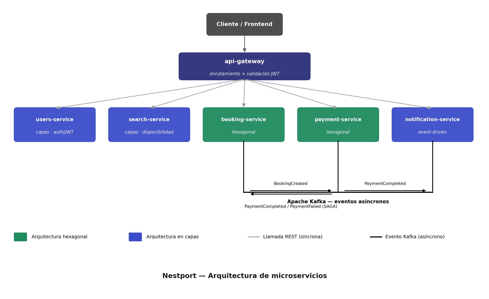

# Nestport

Sistema de reservas distribuido basado en microservicios, inspirado en plataformas tipo Booking.com. Arquitectura orientada a demostrar patrones de diseño hexagonal, comunicación asíncrona vía eventos y coreografía SAGA entre servicios.

## Arquitectura

El **api-gateway** enruta las peticiones síncronas (REST) hacia cada servicio y valida el JWT en el punto de entrada. La coordinación entre `booking-service` y `payment-service` se resuelve mediante **coreografía SAGA sobre Kafka**: `booking-service` crea la reserva y emite `BookingCreated`; `payment-service` procesa el cobro y responde con `PaymentCompleted` o `PaymentFailed`, lo que permite a `booking-service` confirmar o cancelar la reserva. Una vez completado el pago, `notification-service` consume el evento `PaymentCompleted` para enviar la confirmación al usuario.

## Servicios

| Repositorio | Responsabilidad | Patrón |
|---|---|---|
| [`api-gateway`](https://github.com/nestport/api-gateway) | Punto de entrada único, enrutamiento y validación de JWT | — |
| [`users-service`](https://github.com/nestport/users-service) | Gestión de usuarios, autenticación y emisión de JWT | Capas |
| [`booking-service`](https://github.com/nestport/booking-service) | Lógica de negocio de reservas, orquesta el SAGA | Hexagonal |
| [`payment-service`](https://github.com/nestport/payment-service) | Procesamiento de pagos | Hexagonal |
| [`search-service`](https://github.com/nestport/search-service) | Búsqueda y disponibilidad de alojamientos | Capas |
| [`notification-service`](https://github.com/nestport/notification-service) | Envío de notificaciones (email, confirmaciones) | Event-driven |

## Stack

- **Backend:** Java, Spring Boot, Spring Security (JWT)
- **Frontend:** Angular
- **Mensajería:** Apache Kafka (SAGA coreografiado entre `booking-service` y `payment-service`; notificación disparada por evento)
- **Arquitectura:** Microservicios, API Gateway, Arquitectura Hexagonal (`booking-service`, `payment-service`)
- **Control de versiones:** Commits firmados con GPG

## Principios de diseño

- **Desacoplamiento:** cada servicio posee su propio dominio y base de datos.
- **Consistencia eventual:** el flujo reserva-pago se resuelve mediante SAGA coreografiado, sin transacciones distribuidas.
- **Seguridad centralizada:** validación de JWT delegada al API Gateway con verificación descentralizada en cada servicio.
- **Testabilidad:** arquitectura hexagonal en los servicios de mayor complejidad de negocio para aislar la lógica de dominio de la infraestructura.

## Autor

Desarrollado por [alvarorc13](https://github.com/alvarorc13).
